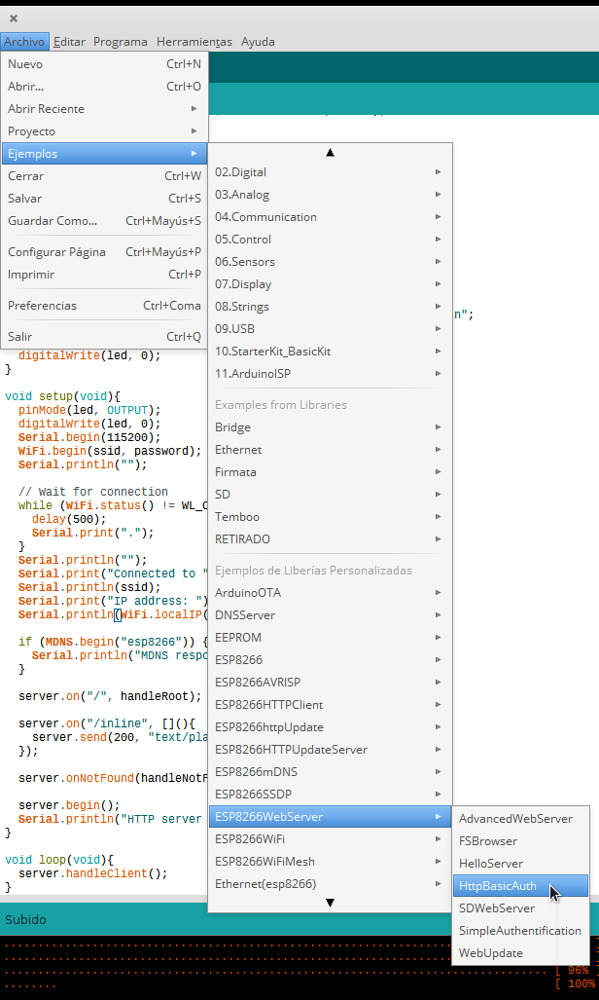

# Tutorial de uso del ESP8266 (ESP01)

Se trata de la placa más pequeña, y muy capaz pero necesitamos una conexión má compleja.

Recomendaría empezar por el nodeMCU o alguna de las otras placas más fáciles de usar

## instalación

En primer lugar tenemos que añadir las placas de tipo ESP al entorno arduino

## Pinout

* 4 pines

  * GPIO0,GPIO02
  * TX y RX

Realmente el chip tiene más GPIO pero no están conectados con pines, si te atreves ...

## Programando

Conectamos GPIO0 a GND y encendemos

## conexión

Para conectarlo a una protoboard

Otro adaptador

[tutorial de uso](http://hackaday.com/2015/03/18/how-to-directly-program-an-inexpensive-esp8266-wifi-module/)

[Tutorial de conexiones](http://www.instructables.com/id/How-to-use-the-ESP8266-01-pins/)

[Distintos tipos de conexiones](http://www.forward.com.au/pfod/ESP8266/GPIOpins/index.html)

## Ejemplos

[Blink 0 y 2]

[webserver]

## Proyectos

[controla leds RGB desde tu reloj](https://www.packtpub.com/books/content/using-your-smart-watch-control-networked-leds?utm_source=Sentori&utm_medium=Email&utm_campaign=Create+Dispatch+-+Mid+May+15)
